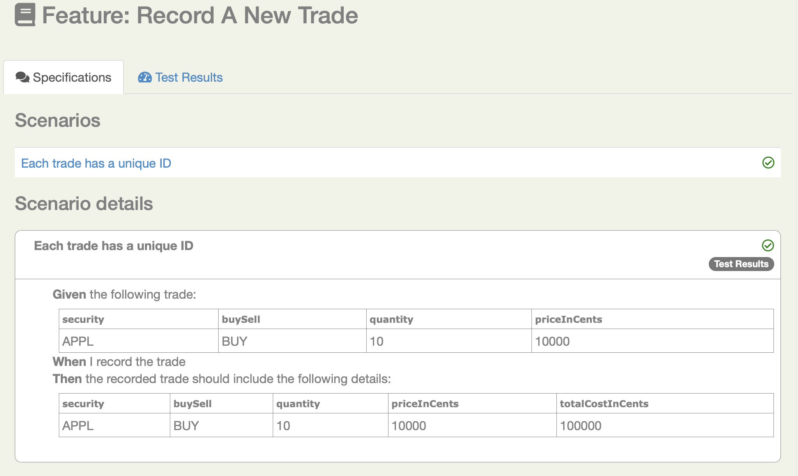

# Serenity BDD and MS Playwright

This tutorial show you how to get started with REST-API testing using Serenity and Cucumber 4. 


### The project directory structure
The project has build scripts for both Maven and Gradle, and follows the standard directory structure used in most Serenity projects:
```Gherkin
src
  + main
  + test
    + java                                Test runners and supporting code
    + resources
      + features                          Feature files

          + status
          + trades
             record_a_new_trade.feature 
      + templates                         Freemarker templates and properties files                

```


## Living documentation

You can generate full Serenity reports by running `mvn clean verify`. 
This includes both the living documentation from the feature files:



And also details of the REST requests and responses that were executed during the test:


## Want to learn more?
For more information about Serenity BDD, you can read the [**Serenity BDD Book**](https://serenity-bdd.github.io/theserenitybook/latest/index.html), the official online Serenity documentation source. Other sources include:
* **[Byte-sized Serenity BDD](https://www.youtube.com/channel/UCav6-dPEUiLbnu-rgpy7_bw/featured)** - tips and tricks about Serenity BDD
* [**Serenity BDD Blog**](https://johnfergusonsmart.com/category/serenity-bdd/) - regular articles about Serenity BDD
* [**The Serenity BDD Dojo**](https://serenitydojo.teachable.com) - Online training on Serenity BDD and on test automation and BDD in general.
"# serenity_bdd_playwright" 
